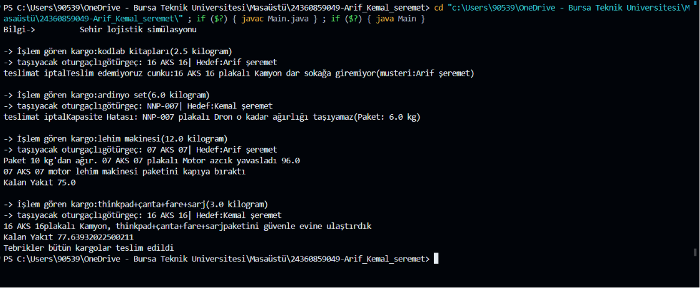
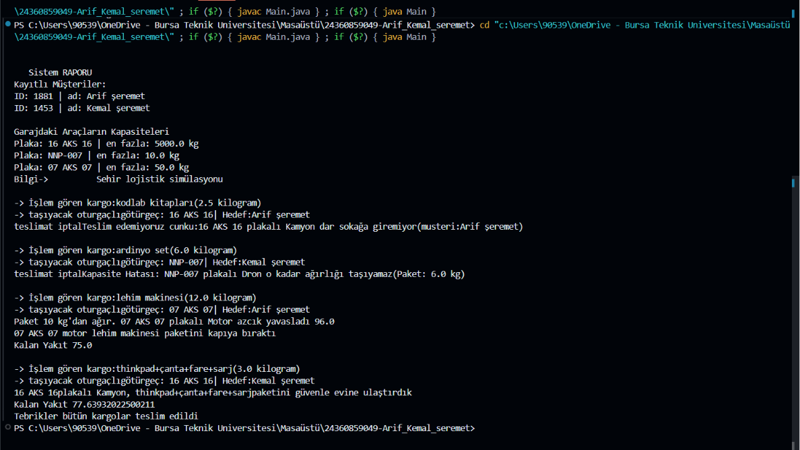
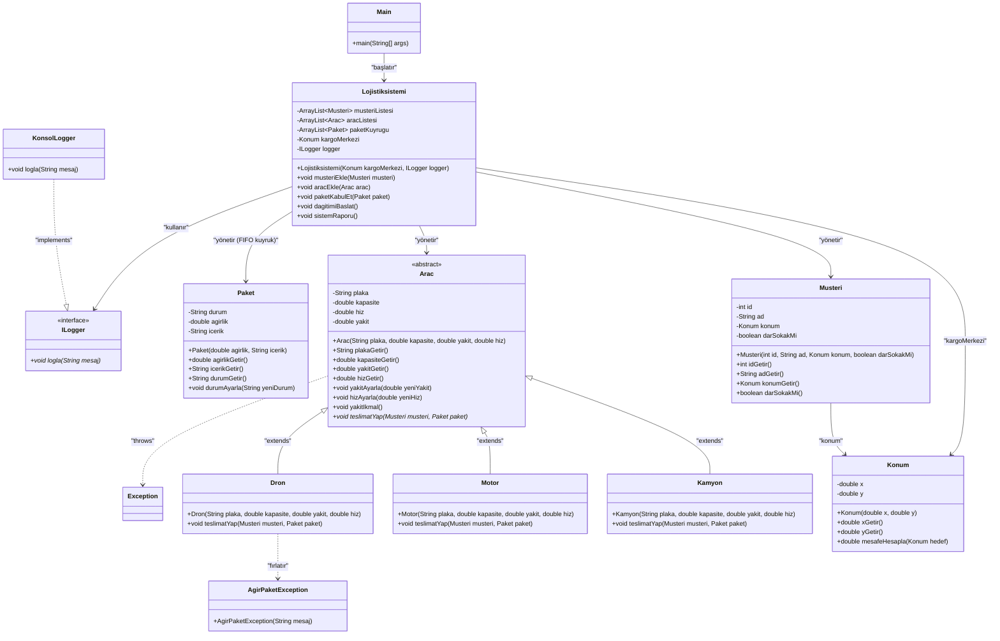

# 🏙️ Akıllı Şehir Lojistik Simülasyon Motoru




## 📌 Projenin Genel Özeti

Bu proje; modern bir akıllı şehrin karmaşık kargo ve lojistik ağını otonom bir şekilde yöneten, esnek ve ölçeklenebilir bir **Simülasyon Motoru** yazılımıdır. Projenin temel amacı; Nesneye Yönelik Programlama (NYP/OOP) prensiplerini (**Kalıtım, Çok Biçimlilik, Soyutlama ve Kapsülleme**) harfiyen uygulayarak, gerçek dünya lojistik kısıtlamalarına ve sınır durumlarına (Edge Cases) yazılımsal çözümler üretmektir.

Sistem; kargo merkezine gelen paketleri dinamik bir şekilde kabul eder, araç filosunun anlık yakıt, hız ve kapasite durumlarını denetler ve her kargoyu en uygun araçla eşleştirerek güvenli teslimat rotaları çizer. Projenin en güçlü yönü, spagetti kod mimarisinden tamamen kaçınılarak tüm iş kurallarının nesnelerin kendi içlerine kapsüllenmiş olmasıdır.

---

## 🎯 Simülasyon Hedefleri ve Zorlu İş Kuralları

Simülasyonun temel hedefi, kargo merkezinde toplanan paketleri **FIFO (İlk Giren İlk Çıkar)** kuyruk mantığıyla tamamen eritirken, gerçek hayattaki fiziksel ve coğrafi kısıtları simüle etmektir. Sistemde otonom olarak işletilen zorunlu iş kuralları şunlardır:

* **🚛 Kamyon Kısıtı (Genişlik ve Sokak Kontrolü):** Büyük taşıma kapasitesine sahip kamyonlar, fiziksel boyutları gereği dar sokaklara giremez. Eğer paketin atanacağı müşterinin `darSokakMi` özelliği `true` ise, kamyon teslimat yapamaz; sistem güvenli bir şekilde istisna (`Exception`) fırlatarak bu teslimatı iptal eder ve bir sonraki uygun araca devreder.
* **🛸 Drone Kısıtı (Ağırlık Bariyeri):** Drone'lar hızlı teslimat yapsalar da maksimum 5 kg taşıma kapasitesine sahiptir. 5 kg ve üzerindeki paketler Drone'a atandığı an sistem, projeye özel tasarlanmış olan `AgirPaketException` hatasını tetikler ve motorun çökmesini engelleyerek süreci yönetir.
* **🏍️ Motosiklet Kısıtı (Dinamik Ağır Yük Matematiği):** Motosikletler kıvraktır ancak ağır yükler altında performans kaybı yaşarlar. Eğer motosiklete atanan paket 10 kg'dan ağırsa, aracın hızı o teslimat eylemi süresince **%20 azalır**. Teslimat tamamlandığında araç hızı otomatik olarak orijinal fabrika değerine döndürülür.
* **⛽ Akıllı Yakıt ve Menzil Yönetimi:** Araçlar, şube ile müşteri konumu arasındaki Öklid mesafesini (Pisagor Teoremi) hesaplayarak hareket eder ve kat ettiği mesafe kadar yakıt tüketir. Yakıt seviyesi yetersizse otonom olarak `yakitIkmal()` fonksiyonu çağrılır. Eğer gidilecek yol aracın maksimum depo kapasitesini (100 birim) bile aşıyorsa, sonsuz döngüleri engellemek adına savunma amaçlı bir `RuntimeException` fırlatılarak paket güvenli moda alınır.

---

## 🗺️ Sistem Mimarisi ve UML Diyagramı

Projenin hiyerarşik sınıf yapısını, arayüz sözleşmelerini ve nesnelerin birbirleriyle olan bağımlılık ilişkilerini gösteren UML Sınıf Diyagramı aşağıdadır:



---

## 🏗️ Sınıf Yapıları ve Teknik Sorumluluklar

Proje, her sınıfın tek bir göreve odaklandığı **Single Responsibility (Tek Sorumluluk)** prensibine göre modüler olarak geliştirilmiştir:

**`Konum`:** Şehir matrisindeki x ve y koordinatlarını saklar. `Math.hypot` kullanarak iki nokta arasındaki kuş uçuşu mesafeyi hesaplayan `mesafeHesapla()` motoruna sahiptir.

**`Musteri`:** Müşterinin benzersiz ID'sini, adını, haritadaki konumunu ve sokağının genişlik durumunu saklar. Değiştirilemez (Immutable) bir yapıdadır.

**`Paket`:** Kargonun ağırlığını, içeriğini ve simülasyon anındaki anlık durumunu (`Hazirlanmaktadir`, `Yolda`, `Teslim Edildi`) yönetir.

**`Arac` (Abstract):** Tüm araçların ortak atası olan soyut sınıftır. Plaka, kapasite, yakıt ve hız gibi temel özellikleri kapsüller (`private`). Gövdesiz `teslimatYap()` soyut metodu ile polimorfizmin temelini atar.

**`Kamyon` / `Motor` / `Dron`:** `Arac` sınıfından türetilen, kendilerine has hız/kapasite konfigürasyonları ve özel kısıt kontrolleri olan somut nesnelerdir.

**`ILogger` (Interface) & `KonsolLogger`:** Sistemin gevşek bağlı (Loose Coupling) olmasını sağlayan mimari sözleşmedir. Sistem çıktıları doğrudan konsola bağımlı değildir; ilerleyen sürümlerde logları `.txt` dosyasına veya veritabanına yazmak için sadece yeni bir implementasyon eklemek yeterli olacaktır.

**`Lojistiksistemi`:** Simülasyonun ana işlemcisidir. Müşterileri ve araçları saklar; `ArrayList` üzerinde `remove(0)` işleterek kusursuz bir FIFO kuyruk mekanizması yönetir.

---

## 🚀 Çalıştırma Rehberi ve Kurulum

### Gereksinimler

* Bilgisayarınızda **JDK 11** veya üzeri kurulu olmalıdır.
* Herhangi bir dış kütüphane bağımlılığı yoktur (yalnızca standart `java.util.ArrayList` kullanılmıştır).

### Yerel Kurulum ve Çalıştırma

Projeyi bilgisayarınıza klonlayın:

```bash
git clone https://github.com/Arif-kemal/Java-project.git
```

Proje kök dizinine girin ve tüm Java dosyalarını derleyin:

```bash
javac *.java
```

Simülasyon motorunu çalıştırın:

```bash
java Main
```

---

## 🧪 Test Senaryoları ve Sınır Durumları (Edge Cases)

`Main.java` içerisinde, akıllı kısıtların doğru çalışıp çalışmadığını denetlemek amacıyla özel sınır durum testleri kurgulanmıştır:

**Test 1 — Dar Sokak İstisnası (Müşteri 1881 - Arif Şeremet):** Müşterinin `darSokakMi` değeri `true` olarak atanmıştır. Kamyon bu müşteriye kargo götürmeye çalıştığında fırlatılan istisna konsolda başarıyla yakalanır.

**Test 2 — Drone Ağırlık Sınırı (6 kg'lık Paket):** Drone'a atanarak 5 kg sınırı test edilmiştir. Sistem güvenli bir şekilde `AgirPaketException` fırlatır, program çökmez ve sıradaki kargoya geçer.

**Test 3 — Motosiklet Hız Düşüşü (12 kg'lık Paket):** Motosiklete atılmıştır. Konsol çıktısında motorun hızının anlık olarak %20 düştüğü, teslimat sonrasında ise orijinal hızına döndüğü matematiksel olarak kanıtlanır.

---

## 🛠️ Kullanılan Teknolojiler ve Yaklaşımlar

**Dil:** Vanilla Java (Standart Kitaplık)

**Mimari Tasarım:** Dependency Injection (Logger yönetimi için Bağımlılık Enjeksiyonu)

**Hata Yönetimi:** Custom Checked/Unchecked Exceptions (`AgirPaketException`, `RuntimeException`)

**Veri Yapıları:** FIFO Queue (`ArrayList` üzerinden kaydırma algoritması ile)

---

## ⚠️ Bilinen Eksiklikler ve Gelecek Hedefler

Bu proje, OOP prensiplerini pekiştirmek amacıyla geliştirilmiş bir simülasyon prototipidir. Aşağıdaki eksiklikler farkındayım ve ilerleyen sürümlerde gidermek istiyorum:

**Mevcut Eksiklikler:**

* `Main.java` dosyasında `Scanner` kullanılmamıştır; kullanıcı tüm test verilerini kod içinde statik olarak tanımlar, çalışma zamanında dinamik girdi alınamaz.
* Paket ağırlığı veya müşteri ID'si gibi değerler için sıfır ya da negatif girdi kontrolü bulunmamaktadır. Örneğin `-5 kg` ağırlıklı bir paket veya `id = 0` olan bir müşteri sisteme sorunsuz eklenebilir, bu mantıksal bir hatadır.
* Var olmayan bir müşteriye paket atanmaya çalışıldığında ya da araç listesi boşken dağıtım başlatıldığında özel bir hata mekanizması yoktur.
* Tek bir teslimat isteğiyle birden fazla paketi aynı müşteriye gönderme (toplu kargo) desteği henüz eklenmemiştir; her paket ayrı ayrı işlenmektedir.

**Yapmak İstediklerim:**

* **Swing / JavaFX ile Grafik Arayüz (GUI):** Konsoldan çalışan simülasyonu görsel bir arayüze taşımak istiyorum. Araçların harita üzerinde hareket ettiği, paket durumlarının renk kodlarıyla gösterildiği ve raporların ekranda canlı güncellendiği bir GUI, projeyi çok daha etkileyici kılacaktır.
* **`Scanner` ile İnteraktif Mod:** Kullanıcının çalışma anında araç ekleyip paket tanımlayabildiği bir komut satırı menüsü eklemek istiyorum.
* **Toplu Kargo Desteği:** Aynı müşteriye birden fazla paketi tek bir teslimat rotasıyla birleştiren bir "toplu gönderi" mekanizması tasarlamak istiyorum.
* **Kapsamlı Girdi Doğrulama:** Tüm constructor'lara negatif/sıfır değer koruması ve var olmayan nesne kontrolü eklenecek.
* **Dosyaya Log Yazma:** `ILogger` arayüzünün sunduğu esnekliği kullanarak `DosyaLogger` implementasyonu eklemek ve simülasyon sonuçlarını `.txt` dosyasına kaydetmek istiyorum.

---

## ✍️ Geliştirenler

**Arif Kemal Şeremet** — Yazılım Mimarı & Algoritma Geliştirici — Bursa Teknik Üniversitesi, Bilgisayar Mühendisliği

---

## 📄 Lisans

Bu proje MIT Lisansı altında lisanslanmıştır. Eğitim ve geliştirme amaçlı tamamen açıktır.